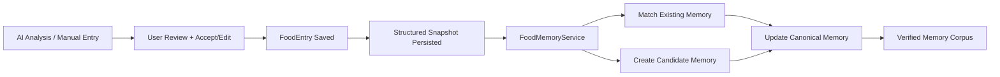

# Food Memory Architecture Plan

## Goal

Design an end-to-end architecture for a high-accuracy saved foods and saved meals system that:

- survives LLM naming drift
- reuses accepted food logs without repeated AI cost
- supports both single foods and multi-component meals
- is verifiable and testable before any user-facing integration

This plan is intentionally architecture-first.

It is not a UI rollout plan.

The objective is to make the data and matching layer solid enough that we can trust it before deciding how to expose it in the app.

## Problem Statement

The current app can analyze food and persist a `FoodEntry`, but the persisted representation is still effectively flat:

- display name
- calories/macros
- serving text
- image/notes metadata
- grouping via `sessionId`

Relevant code:

- [Trai/Core/Models/FoodEntry.swift](/Users/navital/Desktop/Trai/Trai/Core/Models/FoodEntry.swift)
- [Trai/Core/Services/AITypes.swift](/Users/navital/Desktop/Trai/Trai/Core/Services/AITypes.swift)

This is not enough for a robust remembered-food system because:

- AI-generated names are not stable identifiers
- similar meals can be named differently across runs
- meal-level structure is not persisted today
- there is no canonical layer above raw historical logs

The app prompt already encourages reasoning about multiple components in a meal:

- [Trai/Core/Services/AIPromptBuilder.swift](/Users/navital/Desktop/Trai/Trai/Core/Services/AIPromptBuilder.swift)

But those components are not currently preserved as structured persisted data.

## Design Principles

1. `Accepted logs are the source of truth`
   Raw AI output should not directly create reusable food identity.

2. `Display name is not identity`
   Names are for UI. Matching identity must come from structured and normalized signals.

3. `Structure beats semantics`
   Component composition, serving, and nutrition should be primary signals. Semantic matching should only be a secondary tool.

4. `False merge is worse than false split`
   If the system is unsure whether two meals are the same, it should keep them separate.

5. `No AI in the hot path after acceptance`
   Logging a known food or resolving it into memory should not require a fresh AI call.

6. `Architecture before integration`
   No user-facing saved foods/meals feature should ship until matching quality is proven with tests and shadow evaluation.

## Recommended System Shape

There should be three layers:

1. `Food Log Event Layer`
   Historical accepted logs for specific moments in time.

2. `Food Memory Layer`
   Canonical reusable foods and meals built from repeated accepted logs.

3. `Matching + Resolution Layer`
   The system that decides whether a new accepted log strengthens an existing memory or creates a new one.



## Current State Constraints

### SwiftData + CloudKit

The repository already documents CloudKit constraints:

- no unique attributes
- defaults/optionals are required
- optional relationships are safer

Relevant guidance:

- [COMMON_ISSUES.md](/Users/navital/Desktop/Trai/COMMON_ISSUES.md)

Because of this, structured arrays and matching metadata are better stored as JSON-backed fields inside models than as deep relational graphs in Phase 1.

### Existing Meal Grouping

The current app already has a useful meal primitive:

- `sessionId` on `FoodEntry`

Relevant code:

- [Trai/Core/Models/FoodEntry.swift](/Users/navital/Desktop/Trai/Trai/Core/Models/FoodEntry.swift)
- [Trai/Features/Dashboard/DailyFoodTimeline.swift](/Users/navital/Desktop/Trai/Trai/Features/Dashboard/DailyFoodTimeline.swift)

This is valuable because:

- one meal can already span multiple food entries
- historical meal sessions can seed meal-memory creation
- the UI already understands grouped meals

## Proposed Data Model

### 1. Extend `FoodEntry`

Keep `FoodEntry` as the historical event model.

Add:

- `acceptedAnalysisJSON: String?`
  - full accepted structured meal snapshot
- `acceptedComponentsJSON: String?`
  - optional denormalized component array for quick read access
- `foodMemoryIdString: String?`
  - canonical memory this entry was linked to after resolution
- `foodMemoryMatchConfidence: Double`
  - score used when linking
- `foodMemoryMatchVersion: Int`
  - version of the resolver/scoring algorithm
- `foodMemoryResolutionStateRaw: String`
  - `unresolved`, `candidate`, `matched`, `rejected`

Why:

- `FoodEntry` stays backward-compatible for existing UI
- accepted structured data is preserved
- matching decisions become traceable and testable

### 2. Add `FoodMemory`

Add a new `@Model` as the canonical reusable memory layer.

Suggested fields:

- `id: UUID`
- `kindRaw: String`
  - `food`, `meal`
- `statusRaw: String`
  - `candidate`, `confirmed`, `retired`, `merged`
- `displayName: String`
- `primaryNormalizedName: String`
- `aliasesJSON: String`
- `componentsJSON: String`
- `nutritionProfileJSON: String`
- `servingProfileJSON: String`
- `fingerprintsJSON: String`
- `observationCount: Int`
- `confirmedReuseCount: Int`
- `confidenceScore: Double`
- `representativeEntryIdsJSON: String`
- `createdAt: Date`
- `updatedAt: Date`
- `lastObservedAt: Date`

Why one model instead of separate food and meal models:

- single matching pipeline
- simpler persistence and migration
- `kindRaw` distinguishes single foods from multi-component meals

### 3. Codable Structures Stored as JSON

Use JSON-backed codable structs inside models for structure.

Suggested codable types:

- `AcceptedFoodAnalysisSnapshot`
- `AcceptedMealComponent`
- `FoodMemoryComponent`
- `FoodMemoryNutritionProfile`
- `FoodMemoryServingProfile`
- `FoodMemoryFingerprint`
- `FoodMemoryAlias`
- `FoodMemoryMatchExplanation`

This approach is preferred because:

- it works well with current SwiftData/CloudKit constraints
- it avoids deep optional relationships
- it preserves rich structure for matching and debugging

## Structured Snapshot Schema

The accepted snapshot should be the durable structured representation of what the user actually logged.

Suggested shape:

```swift
struct AcceptedFoodAnalysisSnapshot: Codable, Sendable {
    let snapshotVersion: Int
    let sourceKind: SourceKind
    let displayName: String
    let normalizedDisplayName: String
    let mealKind: MealKind
    let totalCalories: Int
    let totalProteinGrams: Double
    let totalCarbsGrams: Double
    let totalFatGrams: Double
    let totalFiberGrams: Double?
    let totalSugarGrams: Double?
    let servingText: String?
    let mealTimeBucket: String?
    let components: [AcceptedMealComponent]
    let userEditsApplied: Bool
    let acceptedAt: Date
}
```

Component shape:

```swift
struct AcceptedMealComponent: Codable, Sendable {
    let displayName: String
    let normalizedName: String
    let role: String
    let quantity: Double?
    let unit: String?
    let calories: Int
    let proteinGrams: Double
    let carbsGrams: Double
    let fatGrams: Double
    let fiberGrams: Double?
    let sugarGrams: Double?
    let confidence: String?
}
```

## AI Contract Changes

### Food Analysis V2

The AI food schema should evolve from a flat meal estimate into:

- top-level meal summary
- structured components

For simple foods:

- the components array has one item

For mixed meals:

- the components array describes the meal composition

This preserves:

- user-visible meal title
- structured identity signals

The model should return:

- `displayName`
- `servingText`
- `totalNutrition`
- `components[]`
- `confidence`
- `notes`

### Important Rule

The AI may propose components, but those components become canonical only after the user accepts the log.

### Manual and Text Entry

The system should work even when AI structure is absent.

Fallback behavior:

- manual entry creates a one-component snapshot from entered values
- text-only entry creates a one-component snapshot unless AI returns richer decomposition
- historical pre-component logs are migrated into one-component snapshots or session-composed meal snapshots

## Canonicalization Strategy

### Why Pure Semantic Matching Is Not Enough

Semantic text similarity is not the right primary key for food identity.

Problems:

- many materially different meals are semantically similar
- similar macros do not guarantee the same meal
- wording drift is common in AI-generated labels
- semantic-only matching is hard to explain and debug

Examples:

- `chicken burrito bowl`
- `teriyaki chicken rice bowl`
- `grilled chicken bowl`

These may or may not be the same practical meal, depending on components and serving.

### Recommended Hybrid Strategy

Use a three-stage resolver:

1. deterministic normalization
2. structural candidate retrieval
3. weighted scoring with optional semantic rerank in ambiguous cases

## Matching Pipeline

### Stage A: Normalize

Input:

- accepted snapshot from the new `FoodEntry`

Normalize:

- display name tokens
- component names
- singular/plural forms
- punctuation/case/diacritics
- coarse serving units
- macro buckets
- time-of-day bucket

Do not over-normalize away meaningful distinctions like:

- grilled vs fried
- chicken vs tofu
- white rice vs noodles

If the distinction changes nutrition or meal identity materially, it should remain represented.

### Stage B: Candidate Retrieval

Retrieve a small set of candidate `FoodMemory` objects using cheap indexed features.

Suggested filters:

- same `kindRaw`
- overlapping meal time bucket
- similar total calorie band
- similar component count band
- overlap on highest-value component tokens
- overlap on dominant macro role

This keeps scoring fast and avoids comparing against the whole memory corpus.

### Stage C: Weighted Scoring

Compute a score for each candidate.

Recommended score components:

- `componentCompositionScore`
  - weighted overlap of components by normalized name and role
- `nutritionProfileScore`
  - percent closeness of calories and macros
- `servingProfileScore`
  - quantity and serving-text compatibility
- `aliasNameScore`
  - token/alias similarity
- `timeContextScore`
  - breakfast/lunch/dinner/snack regularity

Suggested relative weights:

- component composition: `0.45`
- nutrition profile: `0.25`
- serving profile: `0.15`
- alias/name: `0.10`
- time context: `0.05`

The exact weights should be test-driven, not hand-waved.

### Component Matching

Use weighted bipartite-style matching between components.

Each component pair should score based on:

- normalized name similarity
- role match
- macro closeness
- serving closeness

Protein and primary carb components should carry more weight than sauces or garnish.

### Decision Thresholds

Suggested first thresholds:

- `>= 0.90` and margin over next candidate `>= 0.08`
  - auto-link to existing memory
- `0.78 ... < 0.90`
  - ambiguous band, hold as candidate or run optional background semantic tie-break
- `< 0.78`
  - create a new candidate memory

These numbers should be calibrated from test fixtures.

### Semantic Matching Recommendation

Do not use semantic matching as the primary resolver.

Instead, leave it as an optional tie-breaker only when:

- deterministic + structural scoring lands in the ambiguous band
- there are a small number of viable candidates

If used, semantics should be based on:

- canonicalized component text
- not raw AI meal name alone

Recommended use:

- background rerank for candidate pairs
- not blocking the user’s save flow

## Memory Lifecycle

### Candidate Memory

A new accepted food can create a candidate memory.

Candidate memories:

- are not exposed to users yet
- accumulate supporting observations
- can later become confirmed

### Confirmed Memory

A memory becomes `confirmed` when:

- it has repeated accepted observations across distinct days
- and matching confidence remains high

Suggested promotion rules:

- at least `2` accepted observations on separate days for single foods
- at least `2-3` accepted observations for meals
- or explicit user action later like pin/save

### Merge and Retirement

The system should support:

- merging duplicate memories
- retiring stale or superseded memories
- preserving alias history

Merged memories should not lose provenance.

## Suggested Services

### `FoodMemoryService`

Main orchestrator.

Responsibilities:

- load candidate memories
- retrieve candidates
- score candidates
- decide resolution
- update or create `FoodMemory`
- write match metadata back to `FoodEntry`

### `FoodSnapshotBuilder`

Responsibilities:

- build `AcceptedFoodAnalysisSnapshot`
- synthesize fallback snapshots for manual/historical logs
- normalize components and metadata

### `FoodMemoryCanonicalizer`

Responsibilities:

- normalize names and tokens
- build serving and nutrition fingerprints
- derive canonical alias lists

### `FoodMemoryMerger`

Responsibilities:

- periodically compare candidate and confirmed memories
- merge duplicates conservatively

### `FoodMemoryBackfillService`

Responsibilities:

- build snapshots for legacy food logs
- derive meal snapshots from historical `sessionId` groups

## Persistence Strategy

### Hot Path

On save:

1. persist `FoodEntry`
2. persist accepted structured snapshot
3. return control to UI

Then asynchronously:

4. resolve the entry into food memory
5. update memory/link metadata

This keeps the user-facing logging path fast.

### Background Work

Background-safe tasks:

- backfill legacy entries
- candidate memory consolidation
- optional semantic reranking

These should never block the main save interaction.

## Migration Plan

### Historical Logs Without Components

For existing entries:

- create one-component snapshots from flat `FoodEntry` values
- if several entries share `sessionId`, synthesize a meal snapshot from the session

This gives historical data immediate usefulness, even before AI analysis starts returning components.

### New Logs After Schema Upgrade

New AI-assisted logs should store:

- flat `FoodEntry` fields for backward compatibility
- full accepted snapshot JSON

## Accuracy Strategy

### Core Rule

Prefer under-linking to over-linking.

It is acceptable to show fewer remembered meals early.
It is not acceptable to collapse distinct meals into one memory incorrectly.

### Explainability

Every match should be debuggable.

Store a compact explanation payload for development/testing:

- top candidate IDs
- component overlap score
- nutrition score
- alias score
- final score
- threshold result

This is essential for tuning.

## Testing Plan

The system should not be integrated into the app UI until this test plan passes.

### 1. Unit Tests

Add tests for:

- name normalization
- component normalization
- serving normalization
- macro fingerprint generation
- candidate retrieval
- scoring
- threshold decisions

### 2. Fixture-Based Accuracy Tests

Create a curated corpus of meal fixtures:

- same meal, different AI labels
- same meal, slightly different quantities
- meals with similar names but different components
- meals with similar macros but different food identity
- breakfast drink cases
- combo meals with optional side items

Each fixture should declare:

- expected same-memory pairs
- expected different-memory pairs

### 3. Session-Based Meal Tests

Test:

- historical `sessionId` meal groups
- partial overlap sessions
- same breakfast on different days
- same meal plus extra side should not necessarily collapse automatically

### 4. Migration Tests

Test backfill from:

- flat single-item logs
- grouped session logs
- manual entries
- text-only entries

### 5. Integration Tests

Using in-memory SwiftData:

- save accepted log
- build snapshot
- resolve into memory
- update entry link
- re-log same/similar meal
- confirm matching behavior

### 6. Performance Tests

Measure:

- save path latency
- candidate retrieval latency
- memory resolution latency
- migration throughput on larger historical datasets

Targets should be defined before launch, but the goal is:

- no visible degradation in the normal food save flow

### 7. Shadow Mode Evaluation

Before UI integration, run the resolver in shadow mode.

Meaning:

- compute memories and matches
- do not surface them to users yet
- inspect accuracy and ambiguity rates

Useful outputs:

- match confidence distributions
- candidate creation rate
- merge rate
- unresolved rate
- manual inspection samples

## Release Gate Before UI Integration

The feature should not move to user-facing integration until:

1. high-confidence auto-links have near-zero false merges on curated fixtures
2. ambiguous cases mostly remain unresolved rather than incorrectly merged
3. save-path performance is stable
4. migration works on existing log history
5. memory creation/linking is robust in shadow mode

## What Not To Do

- Do not use raw AI meal names as canonical identity.
- Do not rely on semantic text matching as the main resolver.
- Do not put AI calls in the post-accept logging path.
- Do not expose unconfirmed candidate memories in the first user-facing version.
- Do not ship UI for saved meals before the matching layer is proven.

## Recommended Next Build Order

### Phase A: Architecture Foundation

- add accepted snapshot persistence to `FoodEntry`
- extend AI food schema to return components
- build fallback one-component snapshot path for manual/historical entries

### Phase B: Canonical Memory Engine

- add `FoodMemory`
- implement `FoodMemoryService`
- implement deterministic matching and candidate creation
- add traceable match explanations

### Phase C: Verification

- fixture corpus
- integration tests
- migration tests
- performance tests
- shadow mode evaluation

### Phase D: Integration Planning

Only after Phase C passes:

- decide how to expose:
  - exact log-again
  - usual foods
  - usual meals
  - edit-before-log flows

That UI planning is intentionally deferred until the memory layer is trustworthy.

## Recommendation

The right architecture is a hybrid system:

- accepted structured snapshots
- canonical memory models
- deterministic structural matching
- optional semantic tie-break only for ambiguous cases

If we do not add the canonical memory layer and structured component persistence, this feature will likely remain a convenience shortcut rather than a reliable remembered-food system.
