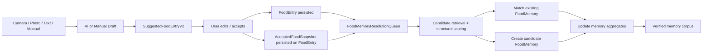

# Food Memory Implementation Spec

## Purpose

Turn the architecture plan into an implementation-ready spec for a high-accuracy food memory system that can support:

- saved foods
- saved meals
- reliable matching across AI naming drift
- low-latency reuse without repeated AI calls
- strong verification before any user-facing rollout

This spec is still pre-UI.

The goal is to make the data and matching system ready end to end, then validate it, then decide how to expose it in the app.

## Repo Reality Check

Current code confirms a few important facts:

- `FoodEntry` is still the persisted historical event model and is effectively flat today.
- `FoodAnalysis` and `SuggestedFoodEntry` are also flat today.
- food suggestions already pass through a user review/edit step before being logged.
- SwiftData in this repo already uses JSON-backed strings and `Data` blobs for richer structures.
- chat has meal suggestion UI, but there is not yet a persisted structured component model for food.

Relevant files:

- [FoodEntry.swift](/Users/navital/Desktop/Trai/Trai/Core/Models/FoodEntry.swift)
- [AITypes.swift](/Users/navital/Desktop/Trai/Trai/Core/Services/AITypes.swift)
- [AIService+Food.swift](/Users/navital/Desktop/Trai/Trai/Core/Services/AIService+Food.swift)
- [AIPromptBuilder.swift](/Users/navital/Desktop/Trai/Trai/Core/Services/AIPromptBuilder.swift)
- [ChatMealComponents.swift](/Users/navital/Desktop/Trai/Trai/Features/Chat/ChatMealComponents.swift)
- [UserProfile.swift](/Users/navital/Desktop/Trai/Trai/Core/Models/UserProfile.swift)
- [ChatMessage.swift](/Users/navital/Desktop/Trai/Trai/Core/Models/ChatMessage.swift)
- [TraiApp.swift](/Users/navital/Desktop/Trai/Trai/TraiApp.swift)

## Product Intent

This system should answer one core product question correctly:

`When a user logs food, can Trai recognize what they tend to eat and reuse it accurately without making them redo work or pay AI cost again?`

That breaks into three product jobs:

1. `Preserve accepted structure`
   If AI or the user identified meal components, that structure should not be discarded.

2. `Build reusable memory`
   Accepted logs should gradually strengthen canonical foods and meals.

3. `Stay conservative`
   If the system is not confident that two things are the same, it should not merge them.

## Non-Goals For This Phase

- no user-facing saved foods UI yet
- no auto-surfacing suggestions yet
- no background LLM matching
- no embeddings service dependency
- no attempt to backfill perfect structure from old flat logs

We are building the durable foundation first.

## Proposed End-to-End Flow



## System Shape

There should be four implementation layers:

1. `Draft Layer`
   AI or manual output before acceptance.

2. `Accepted Snapshot Layer`
   Durable structured representation of what the user actually logged.

3. `Food Memory Layer`
   Canonical reusable foods and meals built from accepted observations.

4. `Resolution Layer`
   Matching, candidate creation, merging rules, and validation output.

This is the extra layer the feature needs. The app cannot get high-confidence remembered foods from `FoodEntry.name` alone.

## Data Model Plan

### 1. Keep `FoodEntry` as the source event

`FoodEntry` remains the historical event model that powers current UI and aggregates.

Add these fields:

```swift
@Model
final class FoodEntry {
    // Existing fields...

    @Attribute(.externalStorage) var acceptedSnapshotData: Data?
    @Attribute(.externalStorage) var acceptedComponentsData: Data?

    var foodMemoryIdString: String?
    var foodMemoryMatchConfidence: Double = 0
    var foodMemoryMatchVersion: Int = 0
    var foodMemoryResolutionStateRaw: String = FoodMemoryResolutionState.unresolved.rawValue
    var foodMemoryResolvedAt: Date?

    var foodMemoryNeedsResolution: Bool = false
    var foodMemoryWasUserEdited: Bool = false
}
```

Proposed resolution enum:

```swift
enum FoodMemoryResolutionState: String, Codable, Sendable {
    case unresolved
    case queued
    case matched
    case createdCandidate
    case rejected
}
```

Why all of these are needed:

- `acceptedSnapshotData` is the durable structured truth.
- `acceptedComponentsData` gives a cheap read path for timeline/detail usage later.
- `foodMemoryIdString` links the event to canonical memory without a risky SwiftData relationship.
- `foodMemoryMatchConfidence` and `foodMemoryMatchVersion` make evaluation traceable.
- `foodMemoryNeedsResolution` lets us resolve off the hot path.
- `foodMemoryWasUserEdited` is important because user-corrected results should carry more weight than untouched AI output.

### 2. Add `FoodMemory`

Create a new canonical memory model:

```swift
@Model
final class FoodMemory {
    var id: UUID = UUID()

    var kindRaw: String = FoodMemoryKind.food.rawValue
    var statusRaw: String = FoodMemoryStatus.candidate.rawValue

    var displayName: String = ""
    var primaryNormalizedName: String = ""
    @Attribute(.externalStorage) var aliasesData: Data?

    @Attribute(.externalStorage) var nutritionProfileData: Data?
    @Attribute(.externalStorage) var servingProfileData: Data?
    @Attribute(.externalStorage) var componentsData: Data?
    @Attribute(.externalStorage) var fingerprintsData: Data?
    @Attribute(.externalStorage) var representativeEntryIdsData: Data?
    @Attribute(.externalStorage) var qualitySignalsData: Data?
    @Attribute(.externalStorage) var matchStatsData: Data?

    var observationCount: Int = 0
    var confirmedReuseCount: Int = 0
    var confidenceScore: Double = 0

    var createdAt: Date = Date()
    var updatedAt: Date = Date()
    var lastObservedAt: Date = Date()
    var retiredAt: Date?
}
```

Enums:

```swift
enum FoodMemoryKind: String, Codable, Sendable {
    case food
    case meal
}

enum FoodMemoryStatus: String, Codable, Sendable {
    case candidate
    case confirmed
    case retired
    case merged
}
```

Status rules:

- `candidate`
  First observation or weakly supported memory.
- `confirmed`
  Repeated observations or high-confidence resolved reuse.
- `retired`
  Memory no longer used for matching.
- `merged`
  Memory folded into another memory and kept only for trace/debug.

### 3. Add `FoodMemoryTypes.swift`

Create a dedicated codable-types file for all structured food-memory payloads.

Suggested file:

- `/Users/navital/Desktop/Trai/Trai/Core/Models/FoodMemoryTypes.swift`

This keeps the memory system from bloating `AITypes.swift`.

## Codable Payloads

### Accepted snapshot

This is the most important durable type in the whole system.

```swift
struct AcceptedFoodSnapshot: Codable, Sendable {
    let version: Int
    let source: AcceptedFoodSource
    let kind: FoodMemoryKind

    let displayName: String
    let normalizedDisplayName: String
    let mealLabel: String?
    let servingText: String?
    let servingQuantity: Double?
    let servingUnit: String?

    let totalCalories: Int
    let totalProteinGrams: Double
    let totalCarbsGrams: Double
    let totalFatGrams: Double
    let totalFiberGrams: Double?
    let totalSugarGrams: Double?

    let components: [AcceptedFoodComponent]
    let notes: String?
    let confidence: FoodAnalysisConfidence?

    let loggedAt: Date
    let mealTimeBucket: MealTimeBucket
    let weekdayBucket: Int

    let userEditedFields: [String]
    let wasUserEdited: Bool
}
```

Supporting types:

```swift
enum AcceptedFoodSource: String, Codable, Sendable {
    case camera
    case photo
    case description
    case manual
    case chat
    case appIntent
    case imported
}

enum FoodAnalysisConfidence: String, Codable, Sendable {
    case high
    case medium
    case low
}

enum MealTimeBucket: String, Codable, Sendable {
    case breakfast
    case lunch
    case dinner
    case lateNight
    case snack
}
```

### Accepted component

```swift
struct AcceptedFoodComponent: Codable, Sendable, Hashable {
    let id: String
    let displayName: String
    let normalizedName: String
    let role: FoodComponentRole
    let quantity: Double?
    let unit: String?

    let calories: Int
    let proteinGrams: Double
    let carbsGrams: Double
    let fatGrams: Double
    let fiberGrams: Double?
    let sugarGrams: Double?

    let preparation: String?
    let confidence: FoodAnalysisConfidence?
    let source: FoodComponentSource
}
```

```swift
enum FoodComponentRole: String, Codable, Sendable {
    case protein
    case carb
    case fat
    case vegetable
    case fruit
    case sauce
    case drink
    case mixed
    case other
}

enum FoodComponentSource: String, Codable, Sendable {
    case ai
    case user
    case derived
}
```

### Canonical memory payloads

```swift
struct FoodMemoryAlias: Codable, Sendable, Hashable {
    let normalizedName: String
    let displayName: String
    let observationCount: Int
    let wasUserEdited: Bool
}

struct FoodMemoryNutritionProfile: Codable, Sendable {
    let medianCalories: Int
    let medianProteinGrams: Double
    let medianCarbsGrams: Double
    let medianFatGrams: Double
    let medianFiberGrams: Double?
    let medianSugarGrams: Double?

    let lowerCaloriesBound: Int
    let upperCaloriesBound: Int
    let lowerProteinBound: Double
    let upperProteinBound: Double
}

struct FoodMemoryServingProfile: Codable, Sendable {
    let commonServingText: String?
    let commonQuantity: Double?
    let commonUnit: String?
    let quantityVariance: Double?
}

struct FoodMemoryComponentSummary: Codable, Sendable, Hashable {
    let normalizedName: String
    let role: FoodComponentRole
    let observationCount: Int
    let typicalCalories: Int
    let typicalProteinGrams: Double
    let typicalCarbsGrams: Double
    let typicalFatGrams: Double
}

struct FoodMemoryFingerprint: Codable, Sendable, Hashable {
    let version: Int
    let type: FingerprintType
    let value: String
}

enum FingerprintType: String, Codable, Sendable {
    case normalizedName
    case roundedMacroSignature
    case componentSet
    case componentRoleSet
    case servingSignature
    case mealTimeBucket
}

struct FoodMemoryQualitySignals: Codable, Sendable {
    let proportionUserEdited: Double
    let proportionWithStructuredComponents: Double
    let distinctObservationDays: Int
    let repeatedTimeBucketScore: Double
}

struct FoodMemoryMatchStats: Codable, Sendable {
    let acceptedMatches: Int
    let rejectedMatches: Int
    let ambiguousMatches: Int
    let lastResolverVersion: Int
}
```

## Draft-Layer Changes

To preserve structure end to end, the flat food types need to evolve.

### Replace flat-only food analysis with v2-compatible payloads

Keep current fields for compatibility, but add structured ones.

Suggested direction:

```swift
struct FoodAnalysis: Codable, Sendable {
    let name: String
    let calories: Int
    let proteinGrams: Double
    let carbsGrams: Double
    let fatGrams: Double
    let fiberGrams: Double?
    let sugarGrams: Double?
    let servingSize: String?
    let confidence: String?
    let notes: String?
    let emoji: String?

    let components: [FoodAnalysisComponent]?
    let mealKind: String?
}

struct FoodAnalysisComponent: Codable, Sendable {
    let displayName: String
    let role: String?
    let quantity: Double?
    let unit: String?
    let calories: Int
    let proteinGrams: Double
    let carbsGrams: Double
    let fatGrams: Double
    let fiberGrams: Double?
    let sugarGrams: Double?
    let confidence: String?
}
```

### Upgrade `SuggestedFoodEntry`

`SuggestedFoodEntry` should become the transport object that survives review/edit before logging.

Add:

```swift
struct SuggestedFoodEntry: Codable, Sendable, Identifiable, Equatable {
    // Existing fields...

    let components: [SuggestedFoodComponent]
    let mealKind: String?
    let notes: String?
    let confidence: String?
    let schemaVersion: Int
}

struct SuggestedFoodComponent: Codable, Sendable, Equatable, Hashable {
    let id: String
    let displayName: String
    let role: String?
    let quantity: Double?
    let unit: String?
    let calories: Int
    let proteinGrams: Double
    let carbsGrams: Double
    let fatGrams: Double
    let fiberGrams: Double?
    let sugarGrams: Double?
    let confidence: String?
}
```

This is necessary because:

- the user edits the suggestion before save
- the final accepted snapshot should reflect accepted draft data
- components must survive the review UI, not just the initial AI response

Implementation note:

- all new draft-layer fields should get safe defaults during rollout
- `components` should default to `[]`
- `schemaVersion` should default to `1` for legacy construction and `2` once the new contract is live

## Snapshot Builder

Create:

- `/Users/navital/Desktop/Trai/Trai/Core/Services/FoodSnapshotBuilder.swift`

Responsibilities:

- convert `FoodAnalysis` or `SuggestedFoodEntry` or manual entry form state into `AcceptedFoodSnapshot`
- normalize names
- derive default component list for flat/manual entries
- assign time buckets
- mark edited fields

Suggested API:

```swift
struct FoodSnapshotBuilder {
    func buildAcceptedSnapshot(
        from suggestion: SuggestedFoodEntry,
        inputSource: FoodLogInputSource,
        loggedAt: Date,
        userEditedFields: Set<String>
    ) -> AcceptedFoodSnapshot

    func buildAcceptedSnapshot(
        from entry: FoodEntry,
        source: AcceptedFoodSource
    ) -> AcceptedFoodSnapshot
}
```

Manual-entry fallback rule:

- if there are no explicit components, create one derived component representing the whole food
- mark that component `source = .derived`
- do not block memory creation just because structure is limited

Persistence helpers should mirror existing patterns in `ChatMessage`:

- computed properties for decoding/encoding `acceptedSnapshotData`
- computed properties for decoding/encoding `acceptedComponentsData`
- no ad hoc JSON decoding in hot SwiftUI getters

## Normalization Plan

Create:

- `/Users/navital/Desktop/Trai/Trai/Core/Services/FoodNormalizationService.swift`

Responsibilities:

- lowercase
- trim punctuation and filler words
- singularize obvious plurals
- normalize connector phrases
- normalize common food synonyms only when deterministic

Examples:

- `grilled chicken bowl with rice` -> `chicken rice bowl`
- `2 scrambled eggs` -> `scrambled egg`
- `protein shake (chocolate)` -> `chocolate protein shake`

Important rule:

Do not aggressively collapse names beyond what we can explain deterministically.

False merges are the bigger risk.

## Matching Architecture

Create:

- `/Users/navital/Desktop/Trai/Trai/Core/Services/FoodMemoryService.swift`
- `/Users/navital/Desktop/Trai/Trai/Core/Services/FoodMemoryMatcher.swift`
- `/Users/navital/Desktop/Trai/Trai/Core/Services/FoodMemoryIndex.swift`

### `FoodMemoryService`

Orchestrates:

- queue unresolved entries
- resolve unresolved entries in batches
- create new memories
- update existing memories
- merge memories only via explicit conservative rules

Suggested API:

```swift
@MainActor
final class FoodMemoryService {
    func enqueueResolution(for entry: FoodEntry, modelContext: ModelContext)
    func resolvePendingEntries(limit: Int, modelContext: ModelContext) throws
    func rebuildInMemoryIndex(modelContext: ModelContext) throws
}
```

### `FoodMemoryIndex`

This should be an in-memory derived index, not a persisted model.

Why:

- the user-level food corpus is likely small enough for in-memory indexing
- no extra migration burden
- faster to iterate and easy to invalidate

Index maps:

- normalized name token -> memory ids
- component normalized name -> memory ids
- rounded macro signature -> memory ids
- meal time bucket -> memory ids

### `FoodMemoryMatcher`

Pipeline:

1. derive query features from `AcceptedFoodSnapshot`
2. retrieve candidate memories from the in-memory index
3. score each candidate
4. decide `match`, `createCandidate`, or `reject`
5. return explanation payload for evaluation

Suggested result:

```swift
struct FoodMemoryMatchResult: Sendable {
    let outcome: MatchOutcome
    let memoryId: UUID?
    let confidence: Double
    let explanation: FoodMemoryMatchExplanation
}

enum MatchOutcome: String, Codable, Sendable {
    case matched
    case createCandidate
    case reject
}

struct FoodMemoryMatchExplanation: Codable, Sendable {
    let resolverVersion: Int
    let topSignals: [String]
    let penalties: [String]
    let consideredMemoryIds: [UUID]
    let winningScore: Double
    let runnerUpScore: Double?
}
```

## Scoring Plan

Use weighted structural scoring first.

### Primary signals

- component overlap score
- component role overlap score
- macro proximity score
- serving similarity score
- normalized name score
- repeated time-bucket support

### Penalties

- conflicting primary protein component
- conflicting dominant carb component
- macro delta beyond tolerance
- meal-vs-single-food mismatch
- low-structure draft penalty

### Initial weighting recommendation

Use this as a starting point, then tune with fixtures:

- `0.35` component overlap
- `0.20` macro proximity
- `0.15` normalized name similarity
- `0.10` serving similarity
- `0.10` component role pattern
- `0.10` meal-time support

Hard fail rules:

- if kind differs and component evidence is weak, do not match
- if dominant component conflicts and macro distance is large, do not match
- if total calories differ by more than a configurable upper band and structure is weak, do not match

### Confidence bands

- `>= 0.84`
  auto-match
- `0.68 ... 0.83`
  create candidate or leave unresolved depending on evidence
- `< 0.68`
  do not merge

These thresholds should be treated as provisional until fixture evaluation is complete.

## Semantic Matching Recommendation

Do not make semantic matching part of the core v1 resolver.

Recommendation:

- `v1`
  deterministic structural matching only
- `v1.5`
  manual alias accrual from accepted repeated observations
- `v2`
  optional local semantic tie-break only if structural score is ambiguous

If we ever add semantic support, it should follow these rules:

- local-only, no network dependency
- never override a strong structural mismatch
- only rerank candidates already surfaced by deterministic retrieval
- fully disable-able behind a resolver flag

This keeps the system explainable and testable.

## Memory Lifecycle

### Create

When an accepted snapshot has no strong match:

- create a new `FoodMemory`
- status = `candidate`
- observationCount = 1
- aliases contain the accepted display name

### Strengthen

When repeated accepted observations resolve to the same memory:

- update nutrition profile medians
- update alias counts
- update component summaries
- increase confidence score
- promote to `confirmed` once thresholds are met

Promotion recommendation:

- at least `3` observations on at least `2` distinct days
- or `2` observations with both marked user-edited or otherwise high-confidence

### Merge

Only merge memories when:

- both are already `confirmed`
- structural overlap is very strong
- recent observations do not conflict

Merging should be an explicit maintenance path, not part of first-pass entry resolution.

## Resolution Scheduling

Do not resolve in the hot logging path.

Recommended behavior:

1. user accepts a suggestion
2. app saves `FoodEntry`
3. app saves `AcceptedFoodSnapshot`
4. entry is marked `foodMemoryNeedsResolution = true`
5. resolution runs asynchronously:
   - shortly after save
   - on app foreground idle
   - on a capped batch loop

Suggested limits:

- resolve at most `5` entries immediately after a save burst
- resolve at most `25` entries on maintenance pass
- rebuild the in-memory index only when memory count changes or app launches

This keeps the feature current without blocking logging UX.

## Integration Points

### Logging flows that must emit accepted snapshots

- camera food logging
- photo-library food logging
- text-description food logging
- manual food entry
- chat meal logging
- app-intent food logging

### Main codepaths likely to change

- [AIService+Food.swift](/Users/navital/Desktop/Trai/Trai/Core/Services/AIService+Food.swift)
- [AITypes.swift](/Users/navital/Desktop/Trai/Trai/Core/Services/AITypes.swift)
- [FoodEntry.swift](/Users/navital/Desktop/Trai/Trai/Core/Models/FoodEntry.swift)
- [AddFoodView.swift](/Users/navital/Desktop/Trai/Trai/Features/Food/AddFoodView.swift)
- [FoodCameraView.swift](/Users/navital/Desktop/Trai/Trai/Features/Food/FoodCameraView.swift)
- [FoodCameraReview.swift](/Users/navital/Desktop/Trai/Trai/Features/Food/FoodCameraReview.swift)
- [ChatViewActions.swift](/Users/navital/Desktop/Trai/Trai/Features/Chat/ChatViewActions.swift)
- [LogFoodTextIntent.swift](/Users/navital/Desktop/Trai/Trai/Core/Intents/LogFoodTextIntent.swift)
- [TraiApp.swift](/Users/navital/Desktop/Trai/Trai/TraiApp.swift)

### Schema registration

When implementation starts, `FoodMemory.self` will need to be added to the app schema in:

- [TraiApp.swift](/Users/navital/Desktop/Trai/Trai/TraiApp.swift)

## AI Contract v2

### Prompt change

Food prompts should explicitly request:

- meal-level summary
- structured components
- each component's rough role and macros
- confidence at the meal level and component level

### Schema shape

Recommended response contract:

```json
{
  "name": "Grilled chicken rice bowl",
  "calories": 640,
  "proteinGrams": 42,
  "carbsGrams": 58,
  "fatGrams": 18,
  "fiberGrams": 6,
  "sugarGrams": 5,
  "servingSize": "1 medium bowl",
  "confidence": "high",
  "notes": "Estimated 5 oz grilled chicken, 1 cup rice, vegetables, light sauce.",
  "emoji": "🍚",
  "mealKind": "meal",
  "components": [
    {
      "displayName": "grilled chicken",
      "role": "protein",
      "quantity": 5,
      "unit": "oz",
      "calories": 240,
      "proteinGrams": 38,
      "carbsGrams": 0,
      "fatGrams": 5,
      "fiberGrams": 0,
      "sugarGrams": 0,
      "confidence": "high"
    },
    {
      "displayName": "white rice",
      "role": "carb",
      "quantity": 1,
      "unit": "cup",
      "calories": 205,
      "proteinGrams": 4,
      "carbsGrams": 45,
      "fatGrams": 0,
      "fiberGrams": 1,
      "sugarGrams": 0,
      "confidence": "high"
    }
  ]
}
```

Backward-compatibility rule:

- if `components` are absent, snapshot builder must create a single derived component
- existing UI should keep working while v2 rolls out

## Migration Plan

### Existing rows

Do not try to perfectly reconstruct structured components for historical flat entries.

Migration behavior:

- new fields on `FoodEntry` default to nil / empty / false
- historical `FoodEntry` rows stay valid
- if an old entry is ever reused or touched, build a best-effort derived snapshot from flat fields

### Backfill

Create:

- `/Users/navital/Desktop/Trai/Trai/Core/Services/FoodMemoryBackfillService.swift`

Backfill strategy:

1. scan recent accepted entries first
2. only backfill entries with enough signal
3. create derived one-component snapshots for flat old entries
4. resolve in capped batches

Backfill should be optional and resumable.

## Implementation Slices

### Slice 1: Foundation Types

Ship:

- `FoodMemory` model
- `FoodMemoryTypes.swift`
- `FoodEntry` field additions
- schema registration
- codable helpers

Validation:

- compile safety
- model container boot
- migration from existing store

### Slice 2: Draft + Snapshot Upgrade

Ship:

- `FoodAnalysis` v2-compatible component fields
- `SuggestedFoodEntry` component transport fields
- `FoodSnapshotBuilder`
- accepted snapshot persistence in all log paths

Validation:

- snapshot persistence tests
- existing logging flow regression tests
- backward compatibility with flat responses

### Slice 3: Resolver Core

Ship:

- `FoodNormalizationService`
- `FoodMemoryIndex`
- `FoodMemoryMatcher`
- `FoodMemoryService`
- async resolution queue

Validation:

- unit tests for normalization
- fixture-based scoring tests
- integration tests with in-memory SwiftData

### Slice 4: Backfill + Shadow Mode

Ship:

- `FoodMemoryBackfillService`
- resolver metrics logging
- shadow-eval harness

Validation:

- compare resolver decisions against labeled fixtures
- inspect false merges and false splits
- verify performance on realistic histories

Only after Slice 4 passes should we plan UI integration.

## Testing Plan

### 1. Unit tests

Target new tests for:

- normalization
- time-bucket assignment
- derived-component fallback
- fingerprint generation
- score band thresholds

### 2. Fixture tests

Create labeled fixtures for:

- same meal with different AI wording
- same meal with slightly different portion sizes
- same meal after user edits
- similar but distinct meals
- meal vs single item
- protein shake flavor variants
- coffee variants
- burgers with and without fries
- salad with rotating protein source

Each fixture should assert:

- expected candidate set
- expected top match
- expected no-match when appropriate

### 3. Migration tests

Verify:

- old stores still load
- new optional fields do not break CloudKit-safe defaults
- entries without snapshots still render correctly

### 4. Integration tests

In-memory SwiftData tests should cover:

- save a suggested food
- persist accepted snapshot
- queue and resolve memory
- update existing memory from repeated logs
- create separate memories for near-miss meals

### 5. Performance tests

Measure:

- snapshot build time during logging
- resolution time for `1`, `10`, and `25` pending entries
- index rebuild time for `50`, `250`, and `1000` memories

Practical target:

- snapshot creation should feel negligible in the logging flow
- immediate post-save resolution should stay well under a frame budget because it runs async
- maintenance passes should complete comfortably in background/idle windows

### 6. Shadow mode

Before any UI usage:

- run resolver on real accepted logs
- do not surface output to users
- inspect candidate creation and merge decisions offline
- tune weights and thresholds from real data

## Release Gate

Do not integrate into product surfaces until all of these are true:

- accepted snapshots are persisted for all food log paths
- resolver produces stable results across fixtures
- no concerning false-merge pattern remains
- performance is acceptable on realistic history sizes
- backfill and migration behavior are safe

## Strong Recommendations

### What to do

- preserve structured accepted food data end to end
- build a canonical memory layer above `FoodEntry`
- use deterministic structural matching as the main resolver
- resolve asynchronously with capped batch sizes
- validate heavily before any product integration

### What not to do

- do not trust AI meal names as canonical identity
- do not put LLM semantic matching in the hot path
- do not ship a remembered-food UI before memory quality is proven
- do not silently merge weakly similar meals

## Recommended Immediate Next Step

Start with `Slice 1` and `Slice 2` only.

That means:

1. add the model and codable foundation
2. upgrade food draft payloads to preserve components
3. persist accepted snapshots in every food logging path

That is the smallest build slice that turns this from an idea into a real data foundation we can test.
